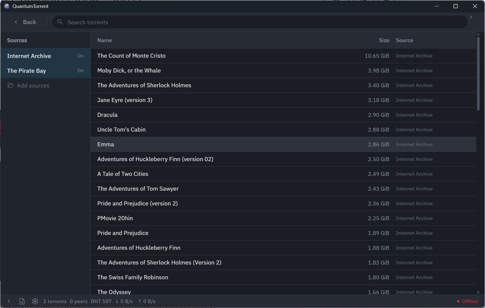
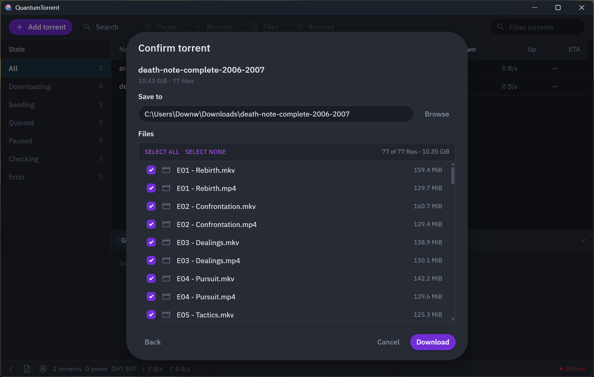
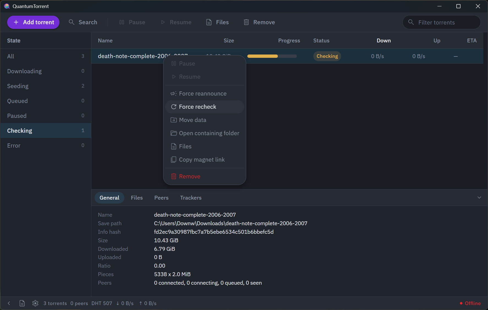

# QuantumTorrent

A modern desktop BitTorrent client with a clean UI, built with Rust.





> **Beta Software** The software is currently usable for day to day use, however due to the early development nature, bugs are expected and some features may be missing.

## Features

### File Transfers
- Add files via magnet link, .torrent files, or from the search page
- Metadata fully retrieved first
- Selective file downloads
- Destination setting
- Force reannounce, force recheck, resume, pause, move folder
- Global speed limits
- Seeding limits, stopping a torrent at a chosen ratio or seed time
- Download queueing, capping how many torrents run at once
- Preview media while it downloads, seeking to any point
- Session persistence

#### Interface Details

- Panel providing information on files, peers, trackers, and other details
- Details on each peer including country, IP, client, and speeds
- Sortable columns, status filters
- Multiple selection with bulk actions
- Compact mode
- Minimise to tray

### Search

- Search across torrent sites from within the app
- Extensible through declarative JSON plugins, so adding a source never runs arbitrary code

### Network
- Configurable binding to network interfaces and ports including automatic selection
- UPnP forwarding support
- Connection state indicator including firewall/port-forwarding warnings

## Installation

To install QuantumTorrent, you can use the builds ready for installation from [Releases](../../releases). Installers are provided for Windows, Linux, and macOS. Alternatively you can manually compile following the *build from source* instructions. 

At this time, builds are unsigned so you may receive automatic warning prompts from SmartScreen or Gatekeeper upon opening the installer.

## Build from source

Prerequisites: [Rust](https://rustup.rs) (stable), [Node](https://nodejs.org) 20+,
and the [Tauri system dependencies](https://tauri.app/start/prerequisites/) for
your platform.

For Ubuntu or Debian systems (most linux systems will follow similar conventions, though check for any missing dependencies) this includes a minimum of:

```bash
sudo apt install \
  build-essential \
  libappindicator3-dev \
  librsvg2-dev \
  libssl-dev \
  libwebkit2gtk-4.1-dev \
  libxdo-dev \
  patchelf
```

And then run:

```bash
npm ci
npm run tauri build
```

The compiled bundles will be available within `src-tauri/target/release/bundle/`.

## Development

```bash
npm run tauri:dev
```

It is important to run under dev when testing, to ensure there are no instance conflicts as `src-tauri/tauri.dev.conf.json` changes the bundle identifier to prevent any conflicts as both cannot run simultaneously otherwise.

## Configuration and Setup

Settings for the application can be found under the platforms config directory (%AppData% on windows, ~/.config/ for Linux distributions, and ~/Library/Application Support/ on macOS.) 

Downloaded files will by default download to the OS Downloads folder. Further configuration options are listed in the interface with explanations beneath each one.

## Interface binding

When setting an interface in app, you pin the inbound listener, outbound peer connections, DHT, HTTP trackers and UDP trackers to that address. If the interface becomes unavailable, it will attempt to reconnect for around 25 seconds before changing state to Offline, following a **fail closed** system — it binds to loopback rather than falling back to the default route.

It is worth noting binding modifies the core library (librqbit) with vendor patches, so that all five egress paths use the chosen address, where upstream binds several sockets to `0.0.0.0`. This means binding disables DHT routing table persistence, so restarts will take longer on DHT bootstrap.

##  Not implemented

These are the features that don't yet exist or function with QuantumTorrent. Features are added regularly, so this may be out of date.

- No categories or labels
- No proxy support, IP blocklist, DHT toggling (see binding behaviour)
- No renaming files

## Vendoring

`src-tauri/vendor/` holds a modified copy of librqbit (8.1.1) and the associated tracker-comms crate. **These are deliberately tracked** and the software will not build without them.  Once these become available upstream, the vendored patches will be deprecated in favor of the upstream implementation. 

## License

QuantumTorrent is licensed under [GPL-3.0](LICENSE). The bundled GeoIP database is DB-IP Lite, licensed under [CC BY 4.0](src-tauri/resources/GEOIP-ATTRIBUTION.txt). librqbit is under [Apache 2](https://opensource.org/license/Apache-2.0). 

Twemoji Country Flags is licensed under [CC BY 4.0](https://creativecommons.org/licenses/by/4.0/deed.en). IBM Plex Sans is licensed under [OFL-1.1](https://spdx.org/licenses/OFL-1.1.html), Material Symbols is licensed under [Apache 2.0](https://opensource.org/license/Apache-2.0). React and Tauri are licensed under [MIT](https://opensource.org/license/mit).
